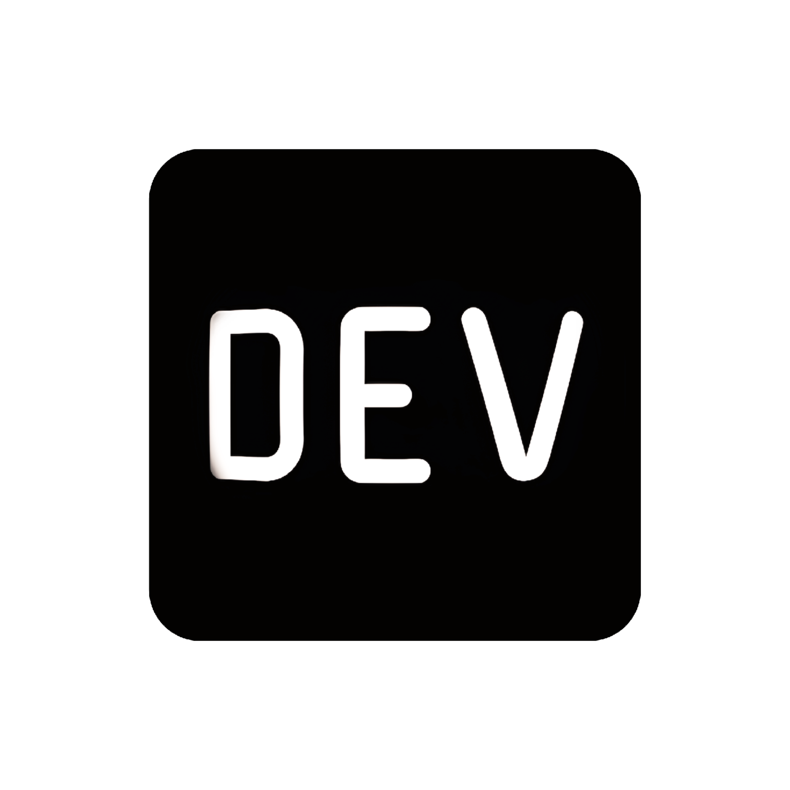

# About Me

🎓 First-Year Computer Science Student  
🏫 Catholic University of Cameroon  
💻 Aspiring Developer | Perfectionist | Overachiever  

---

## Languages & Tools I'm familiar with:
✦ Python  ✦ C/C++  ✦ HTML/CSS  ✦ GitHub  

---

## Interests, Passions & Skills
⌬ Neural Computing  
⌬ Computational Intelligence  
⌬ Coding Challenges & Experiments  
⌬ Web Development  
⌬ Minimalist & Aesthetic Customizations  
⌬ Apple Products & Design Philosophy  
⌬ Fluent in English, Proficient in French, Basic Spanish  

---

## 📫 Connect With Me

<table align="center" border="0">
<tr>
  <td></td>
  <td></td>
  <td></td>
  <td></td>
  <td></td>
</tr>
</table>
